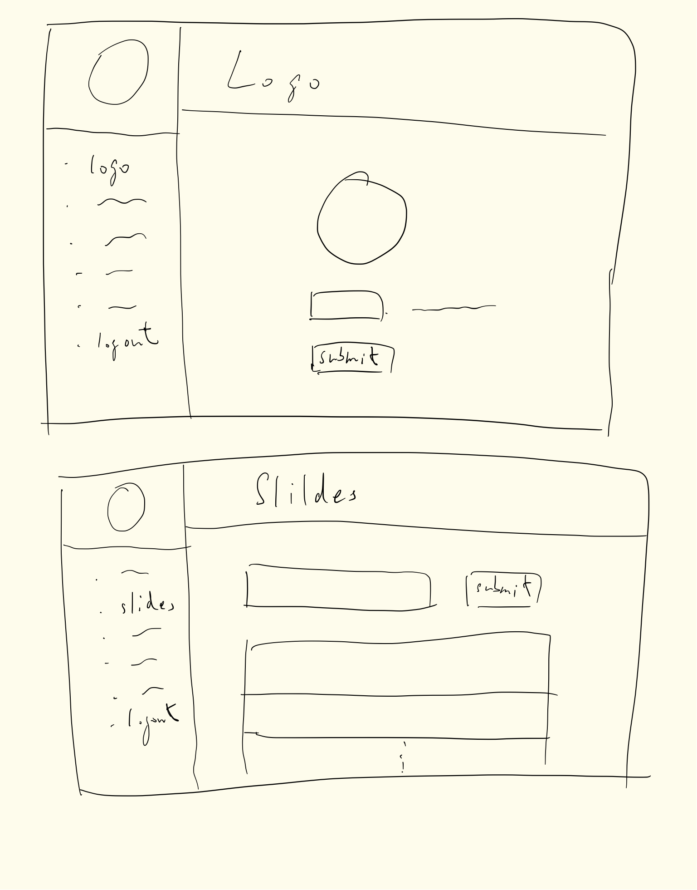
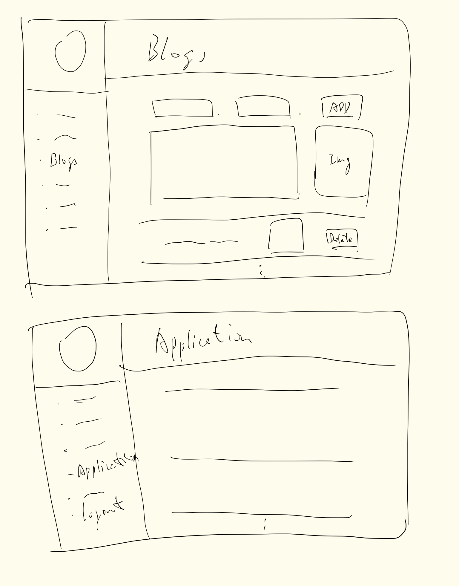
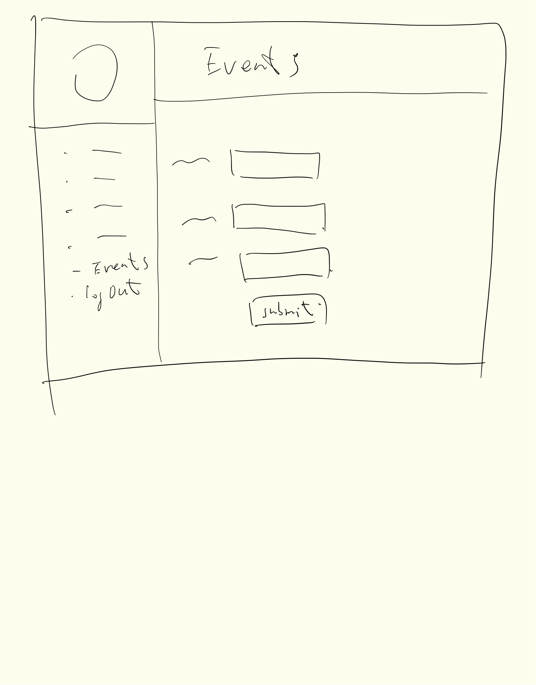
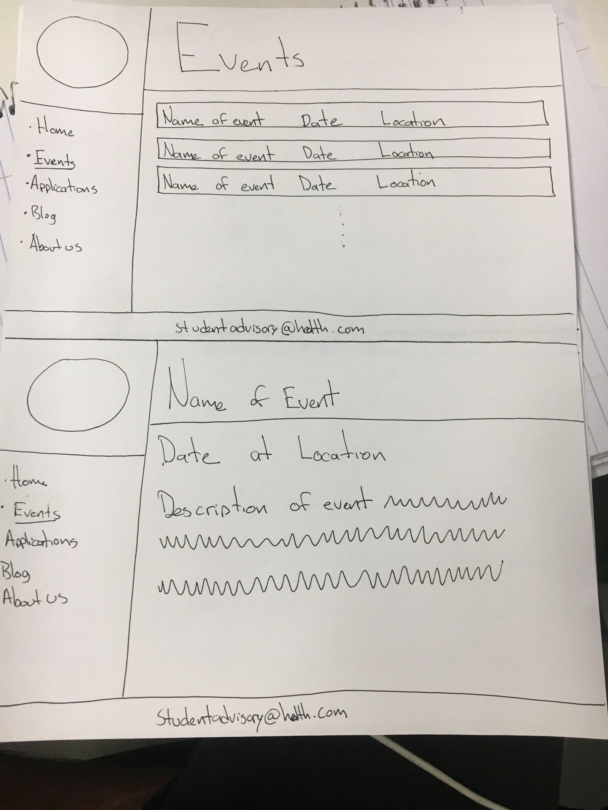
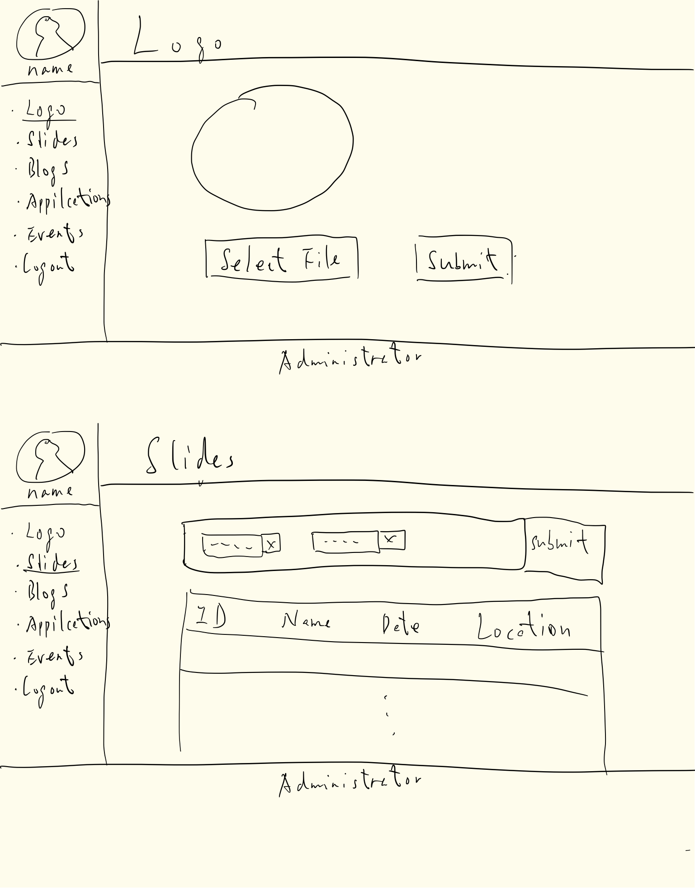
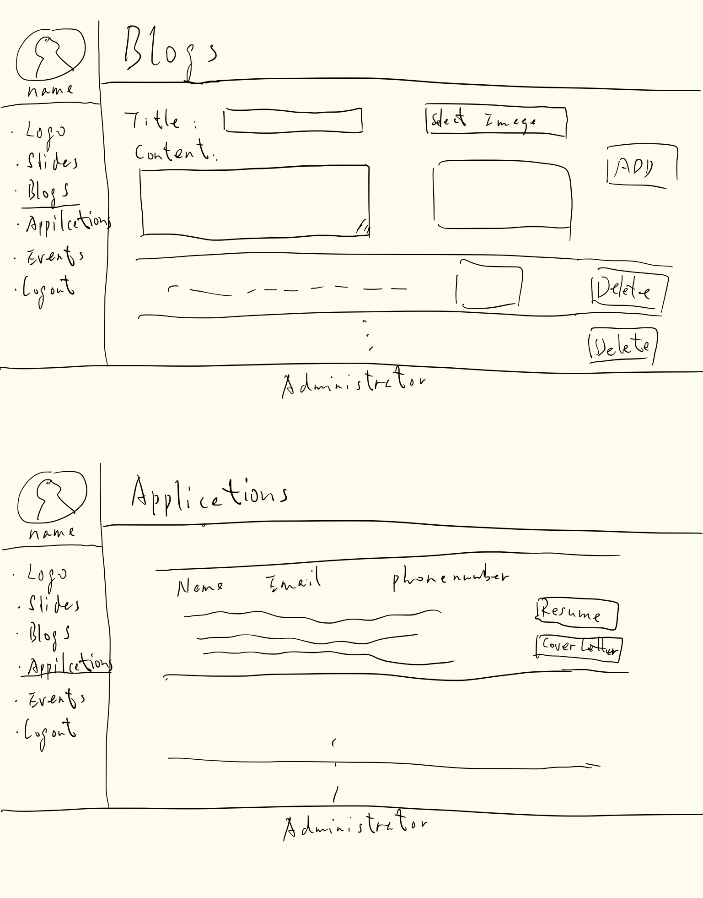
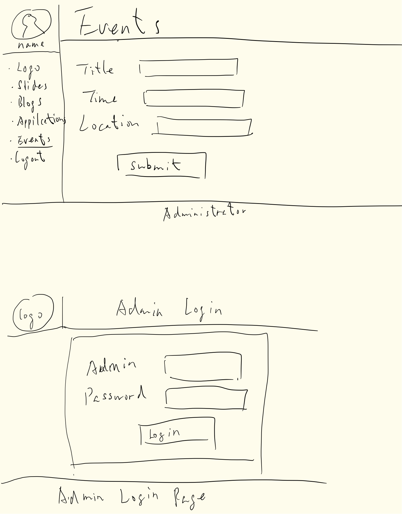

# Project 4 - Design & Plan

Your Team Name: Red Lion

## Milestone 1, Part II: Client Selection

### Client Description

Global Health Student Advisory Board

"something simple as who we are, a section where we could post information about our events, promote our programs and then a section that we could use to post applications for our case completion, post submissions for our symposium and maybe a platform for applications to join our group"


[NOTE: If you are redesigning an existing website, give us the current URL and some screenshots of the current site. Tell us how you plan to update the site in a significant way that meets the final project requirements.]

## Milestone 1, Part III: Client Requirements

### Target Audience(s)

Cornell students that are interested in engaging with the global health program.

### Purpose & Content
Purpose: To provide a way to reach out to the Cornell Community and provide them with a way to easily contact or obtain information about the Global Health Student Advisory Board.
Content:
Pictures of the team
Contact Information
Calendar of events with a link that directs the user to a page containing information about the events
Tab with an application for Global Case Competition which emails to the host when completed

### Needs and Wants

[Collect your client's and target audience's needs and wants for the website. Come up with several appropriate design ideas on how those needs may be met. In the **Memo** field, justify your ideas and add any additional comments you have. There is no specific number of needs required for this, but you need enough to do the job.]

Administrator updates
  Have an administrator login page where they can log in and edit the content of the site.
Possibly have the website in Spanish
  Erie can possibly write the Spanish for the site, or we can use Google Translate.
Blog
  Updated through the administrator updates

Example:
* Needs/Wants #1
  * **Needs and Wants** (What does your client and audience need and want?)
    * Client wants to cater to people who speak different languages.
  * **Design Ideas and Choices** (How will you meet those needs and wants?)
    * Create web-pages manually in multiple languages.
    * Use google translate to auto-translate the site on the fly.
  * **Memo** (Justify your decisions; additional notes.)
    * Creating multiple pages manually would require manual skills, effort and time that we do not have.
    * Using auto-translate using Google-Translate API is an easier way to go. Plus, we would like to learn the Google Translate API.

### Hosting Plan

Cornell webhosting service

### Client's Edits

[Does the client need the ability to edit the site after the end of the semester? If **Yes**, tell us how you site fit your client's need. If **No**, write down N/A.]

Yes

Have administrator updates where administrator can post new pictures, write blogs, etc.

### Information Architecture, Content, and Navigation

[Lay out the plan for how you'll organize the site and which content will go where. Note any content (e.g., text, image) that you need to make/get from the client.]

[Note: As with the Needs and Wants table, there is no specific amount to write here. You simply need enough content to do the job.]
* **Home page**
  * Have description of clients
* **Calendar**
  * All events posted
  * *Details page*
    * Can be accessed by clicking on the event in the calendar
* **Application Page**
  * Page for Case Competition Applications
* **Administrator Page**
  * Login for administrator
  * Administrator will be able to update the site from here
* **Blog**
  * Blog posts about past events and other stuff the administrator wants to have

Example:
* Content #1
  * **Main Navigation** (List your site's navigation here.)
    * Portfolio
  * **Sub-Categories** (List any sub-categories of under the main navigation.)
    * Websites
    * Mobile Apps
    * Tablets
  * **Content** (List all the content corresponding to main navigation and sub-categories.)
    * *Portfolio*: list all the projects (as images) this client has worked on. When the image is hovered over, display a description of the project; add a search function to enable users search for specific projects;
    * *Websites*: showcase all the websites designed by the client, with thumbnail images and a brief description for each design;
    * *Mobile Apps*: showcase all the mobile apps designed by the client, with thumbnail images and a brief description for each design;
    * *Tablets*: showcase all the tablet applications designed by the client, with thumbnail images and a brief description for each design;

### Interactivity

[What interactive features will your site have? What PHP elements will you include?]

[Much of this is up to you, however, implementing a login system is **required**. Logging in should not be required to view the site, however it must unlock extra functionality, e.g., admin functionality, comment posting, etc.]

[Also, describe how the interactivity connects with the needs of the clients/target audience.]
php mail function - Have the site mail the applications to the admin, or at least a notification that an application was posted
databases - they will hold most of the information for the website
php sessions and cookies - for login purposes
input filtering for Applications - for any information that will be posted
We will use php to dynamically output member details and blogs from the database

### External Code

[What libraries (e.g. editor.js, jQuery Cookie, Image Sliders, jQuery) are you planning to use for the site? What do you have to do to incorporate those libraries? How much of your own code will satisfy the project requirements?]

jQuery. To incorporate jQuery, we must first learn how to use it.

### Scale

[How large will the site be (approximate number of pages) and how many hours of work will be required to complete it?]
Approximately 6 or more pages
A lot of hours will be required. We can not make a guess at this point, only that it will take us a lot of time to accomplish.
## Milestone 1, Part IV: Work Distribution

[Describe how each of your responsibilities will be distributed among your group members.]

[Set internal deadlines. Determine your internal dependencies. Whose task needs to be completed first in order for another person's task to be relevant? Be specific in your task descriptions so that everyone knows what needs to be done and can track the progress effectively. Consider how much time will be needed to review and integrate each other's work. Most of all, make sure that tasks are balanced across the team.]

We will hold each other responsible and make sure that each one of us is pulling the same amount of weight. The work will be divided as it is being done, so that if one task seems too hard for a team member, they can divide it with another team member who has a stronger understanding of that area.
We will also have some work done before we meet up, and then combine it when we come together.

We will all come up with ideas for the wireframes and come together and consolidate them

Erie - Administrator page
Barron - Calendar page
David - Home page
Walt - Blog page
Jing - Application page

css - is a group effort

subject to change

## Milestone 1, Part V: Additional Comments

[If you feel like you haven't fully explained your design choices, or if you want to explain some other functions in your site (such as special design decisions that might not meet the final project requirements), you can use this space to justify your design choices or ask other questions about the project and process.]


## Milestone 2, Part I: PHP Interactivity

[Describe here what you plan to do for your PHP Interactivity requirement.]

To allow the admin to edit the content of the web pages we will have a separate /login.php page that will allow someone with admin credentials to login and then change the content of the site. The admin credentials will be stored in a database (password hashed) and then checked against the POST input coming from the login screen


To allow users to submit an application to join the advisory board we will utilize the php mail function and have the user fill out a form that will be used to construct the arguments for the mail function. The user inputs will be filtered appropriately so that the site does not become vulnerable to attacks/exploits

The content of our website will be stored in a sqlite database and will be queried to display the appropriate data

We will use GET requests for the Events page so that users can see events after a certain date

We will use php to manipulate output on the aboutus page from the database


## Milestone 2, Part II: Sketches, Navigation & Wireframes

### Sketches

[Insert your sketches here.]







### Navigation

* Home
* Events
  * Event
* Applications
  * Thanks for applying page
* Blog
  * specific blog
* About us

* **Administrator**
  * Login : Login form
  * Change logo: Form to change logo
  * Edit slide show Pictures : Forms to remove pictures and add new ones
  * Blog
    * Edit/delete/post blog : Shows forms to edit, delete and add blogs
  * View Applications : Shows submitted applications
  * Edit descriptions: Allows admin to edit text
  * Events
    * Add: Shows form to add new event
    * Delete: shows delete message
  * Aboutus
    * delete: shows delete message and link to preview changes
    * new : contains form to add new member

### Wireframes

[Insert your wireframes here.]










## Milestone 2, Part III: Evaluate your Design

[Use the GenderMag method to evaluate your wireframes.]

[Pick a persona that you believe will help you address the gender bias within your design.]

I've selected **Abby** as my persona.

We've selected Abby because the majority of engineers creating the website are men and we have decided to choose a female persona to help balance the design bias relating to gender. Our client is also a woman and we expect that this will help in the design process.


### Tasks

[You will need to evaluate at least 3 tasks (known as scenarios in the GenderMag literature). List your tasks here. These tasks are the same as the task you learned in INFO/CS 1300.]

[For each task, list the ideal set of actions that you would like your users to take when working towards the task.]

Task 1: user submits application

  1. user visits the website
  2. user clicks on apply
  3. user fills out applicaton form
  4. user hits submit
  5. user sees feedback and does not submit again (if the submission was successful)

Task 2: administrator wants to add an event

  1. they add "login.php" to the website path and hit enter
  2. admin inputs credentials
  3. press login
  4. click on the events nav element
  5. click add event
  6. fill out information
  7. clicking submit
  8. seeing feedback and does not submit again (if the submission was successful)
  9. admin logs out


Task 3: administator wants to delete a blog post

  1. they add "login.php" to the website path and hit enter
  2. admin inputs credentials
  3. press login
  4. click on the blog nav element
  5. admin selects the blog post(s) they would like to be deleted
  6. admin clicks on "delete blog post"
  7. admin sees feedback and does not attempt to delete again (if the deletion was successful)
  8. admin logs out

### Cognitive Walkthrough

[Perform a cognitive walkthrough using the GenderMag method for all of your Tasks. Use the GenderMag template in the <documents/gendermag-template.md> file.]

#### Task 1 - Cognitive Walkthrough


Task: **Apply to program**

Subgoal #[1] : *go to apply page*

Will Abby have formed this sub-goal as a step to their overall goal?
Yes

Why?

Because she has the necessary level of skills

Action #[1] : Click applications link

Will Abby know what to do at this step?

Yes

Why?

Because she is literate and has the necessary skills

If Abby does the right thing, will she know that she did the right thing, and is making progress towards her goal?

Yes

Why?

Because the header has 'Apply' written in big bold letters


Subgoal #[2] : *Apply*

Will Abby have formed this sub-goal as a step to their overall goal?
Yes, maybe or no: yes

Why?
Everything is labeled clearly

Action #[1] : Fill in fields

Will Abby know what to do at this step?

Yes, maybe or no: yes

Why?

Everything will be clearly labeled and easy to understand

If Abby does the right thing, will she know that she did the right thing, and is making progress towards her goal?

Yes, maybe or no: yes

Why?

Text will appear in input boxes and she will see


Subgoal #[3] : *Submit application*

Will Abby have formed this sub-goal as a step to their overall goal?
Yes, maybe or no: yes

Why?

Because she is looking to apply

Action #[1] : Click submit button

Will Abby know what to do at this step?

Yes, maybe or no: yes

Why?

The action is not complicated. It is easy enough for her to execute

If Abby does the right thing, will she know that she did the right thing, and is making progress towards her goal?

Yes, maybe or no: yes

Why?

Because she will see a message on the screen saying she successfully submitted her application

#### Task 2 - Cognitive Walkthrough


**Task name: [administrator wants to add an event]**

[Add as many subgoals as you needs]
Subgoal # 1 : **login**

  - Will Abby have formed this sub-goal as a step to their overall goal?
    - Yes, maybe or no: Yes
  - Why?
    - this is a familiar task on the internet

Action # 1 : put login.php in URL

  - Will Abby know what to do at this step?
    - Yes, maybe or no: yes
  - Why?
    - Abby (the administrator) will know to do this everytime she wants to edit something because the dev team will tell her what she needs to do in order to login and will walk through the entire process with her... Abby chose not to have a login button that other (non-admin) users would see and this is the only alternative that the dev team could theorize

  - If Abby does the right thing, will she know that she did the right thing, and is making progress towards her goal?
    - Yes, maybe or no: yes
  - Why?
    - Abby will see the login page...


Action # 2 : **input login credentials**

  - Will Abby know what to do at this step?
    - Yes, maybe or no: yes
  - Why?
      - This is a very familiar part of the internet
  - If Abby does the right thing, will she know that she did the right thing, and is making progress towards her goal?
    - Yes, maybe or no: yes
  - Why?
    - Abby will see her inputs in the login screen


Action # 2 : **press login**

  - Will Abby know what to do at this step?
    - Yes, maybe or no: yes
  - Why?
    - This is a very familiar part of the internet
  - If Abby does the right thing, will she know that she did the right thing, and is making progress towards her goal?
    - Yes, maybe or no: yes
  - Why?
    - Abby will see the next page with feedback regarding the login attempt
Subgoal # [2] : **add an event**
  - Will Abby have formed this sub-goal as a step to their overall goal?
    - Yes, maybe or no: yes
  - Why?
    - she wants to add an event...
Action # [1] : **click on events tab**
  - Will Abby know what to do at this step?
    - Yes, maybe or no: yes
  - Why?
    - this will be very intuitive
  - If Abby does the right thing, will she know that she did the right thing, and is making progress towards her goal?
    - Yes, maybe or no: yes
  - Why?
    -Abby will see the editable events page
Action # [2] : **click add event**
  - Will Abby know what to do at this step?
    - Yes, maybe or no: yes
  - Why? (Especially consider Abby's Knowledge/Skills, Motivations/Strategies, Self-Efficacy and Tinkering.)
    - she wants to add an event so she will click this...
  - If Abby does the right thing, will she know that she did the right thing, and is making progress towards her goal?
    - Yes, maybe or no: yes
  - Why? (Especially consider Abby's Self-Efficacy and Attitude toward Risk.)
    - she will see a form that signifies her click
Action # [3] : **fill out the information**
  - Will Abby know what to do at this step?
    - Yes, maybe or no: yes
  - Why?
    - she wants to add an event, so she will input the information...
  - If Abby does the right thing, will she know that she did the right thing, and is making progress towards her goal
    - Yes, maybe or no: yes
  - Why? (Especially consider Abby's Self-Efficacy and Attitude toward Risk.)
    - there will be stuff filled out...

Action # [4] : **click submit**
  - Will Abby know what to do at this step?
    - Yes, maybe or no: yes
  - Why?
    - she wants to add an event.. so she will click submit after typing the inputs
  - If Abby does the right thing, will she know that she did the right thing, and is making progress towards her goal?
    - Yes, maybe or no: yes
  - Why?
    - Abby will see feedback regarding whether or not the submission was successful
Action # [5] : **admin logs out**
  - Will Abby know what to do at this step?
    - Yes, maybe or no: yes
  - Why? (Especially consider Abby's Knowledge/Skills, Motivations/Strategies, Self-Efficacy and Tinkering.)
    - Abby is now done with her edits so the only logical thing to do is logout
  - If Abby does the right thing, will she know that she did the right thing, and is making progress towards her goal?
    - Yes, maybe or no: yes
  - Why?
    - Abby will see feedback regarding whether or not she was successfully logged out

#### Task 3 - Cognitive Walkthrough
Subgoal #1: *login as admin*

  - Will Abby have formed this sub-goal as a step to their overall goal?
    - Yes, maybe or no: maybe
    - Why?
      She would not come up with this sub-goal on her own, because it is not an option provided in the main website. We will provide her with clear instruction on how to achieve this sub goal.

Action #1 : Type in login.php at end of url

  - Will Abby know what to do at this step?
    - Yes, maybe or no: yes
    - Why? We will tell her that this is the way to access the log in page for administrators, and there is no other way that is can happen

  - If Abby does the right thing, will she know that she did the right thing, and is making progress towards her goal?
    - Yes, maybe or no: yes
    - Why? If she does the right thing, she will see the log in page, if not, she will possibly get a 404 error message

Action #2 : Type in username and password

  - Will Abby know what to do at this step?
    - Yes, maybe or no: yes
    - Why? Because the fields are clearly labeled

  - If Abby does the right thing, will she know that she did the right thing, and is making progress towards her goal?
    - Yes, maybe or no: yes
    - Why? She will see her text input on the screen


Action #3 : Click login button

  - Will Abby know what to do at this step?
    - Yes, maybe or no:yes
    - Why? because the login button is clearly labeled

  - If Abby does the right thing, will she know that she did the right thing, and is making progress towards her goal?
    - Yes, maybe or no: yes
    - Why? She will be redirected the administrator home page

Subgoal # 2: *Delete blog*

  - Will Abby have formed this sub-goal as a step to their overall goal?
    - Yes, maybe or no: yes
    - Why? This is her main task, so yes.

Action #1 : click on Edit Blogs link

  - Will Abby know what to do at this step?
    - Yes, maybe or no: yes
    - Why? because she wants to delete a blog post, and it makes the most sense to click on edit blogs

  - If Abby does the right thing, will she know that she did the right thing, and is making progress towards her goal?
    - Yes, maybe or no: yes
    - Why? She will have navigated to the administrator blog page and will be able to see EDIT BLOGS in the header of the page

Action #2 : click on Delete blog button for specific blog

  - Will Abby know what to do at this step?
    - Yes, maybe or no: yes
  - Why?
    - Because if she wants to delete something, it makes sense to go to the delete button for that blog

  - If Abby does the right thing, will she know that she did the right thing, and is making progress towards her goal?
    - Yes, maybe or no: yes
  - Why?
    - She will be prompted to confrim whether or not she is sure she wants to delete the blog. After she confirms, the blog will be removed and she will no longer see it


### Cognitive Walk-though Results

[Did you discover any issues with your design? What were they? How did you change your design to address the gender-inclusiveness bugs you discovered?]

We reduced the number of steps to delete a blog by adding delete buttons under each of the blogs. We realized that the initial design had a lot of steps which might be confusing for Abby.

[Your responses here should be very thorough and thoughtful.]

## Milestone 2, Part IV: Database Plan

### Database Schema

[Describe the structure of your database. You may use words or a picture. A bulleted list is probably the simplest way to do this.]

Table: accounts
* field 1: id
* field 2: username
* field 3: password
* field 4: session

Table: events
* field 1: id
* field 2: name
* field 3: date_time
* field 4: place
* field 5: introduction
* field 6: image

Table: applications
* field 1: id
* field 2: event_id
* field 3: email
* field 4: name
* field 5: comment

Table: blogs
* field 1: id
* field 2: author_name
* field 3: email
* field 4: create_time
* field 5: title
* field 6: content
* field 7: image

Table: members
* field 1: id
* field 2: first_name
* field 3: last_name
* field 3: email
* field 4: introduction
* field 5: image

### Database Queries

```
select password from accounts where username is ...;
UPDATE accounts SET session = :session WHERE id = :user_id;
select * from events order by date_time DESC;
insert into events (name, date_time, place, introduction, image) values (:name, :date_time, :place, :introduction, :image);
delete form events where id is :event_id;
delete from events where name is :name;
insert into applications (event_id, email, name, comment) values (:event_id, :email, :name, :comment);
select * from blogs order by create_time DESC;
insert into blogs (author_name, email, create_time, title, content, image) values (:author_name, :email, :create_time, :title, :content, :image);
delete from blogs where title is :title;
delete from blogs where id is :blog_id;
select * from members;
insert into members (member_name, email, introduction, image) values (:member_name, :email, :introduction, :image)
```


## Milestone 2, Part V: Structure and Pseudocode

### Structure

[List the PHP files you will have. You will probably want to do this with a bulleted list.]

* index.php - main page.
* events.php
* blog.php
* aboutus.php
* includes/init.php - stuff that useful for every web page.
* includes/footer.php
* includes/header.php
* init/init.sql

*Admin pages*
* admin_login.php
* admin_logo.php
* admin_slides.php
* admin_blogs.php
* admin_applications.php
* admin_event.php
* admin_aboutus.php
* new.php
* new_blog.php
* delete.php


### Pseudocode

[For each PHP file, plan out your pseudocode. You probably want a subheading for each file.]

#### index.php

```
Pseudocode for index.php...

include init.php

TODO
```

#### includes/init.php

```
messages = array to store messages for user (you may remove this)

// DB helper functions (you do not need to write this out since they are provided.)

db = connect to db

...

```

#### events.php

```
execute sql
for each event in events
  echo (<a>
  Name
  date and time
  location
  </a>);
if($_GET)
  search database for specific event
  echo name
  date
  time
  location
  description
```

#### blog.php
```
include init.php
get blog_id

head: include all.css
body:
	include header.php

	if blog_id:
		select the blog whose id is blog_id from the database
		show the blog
	else:
		select all the blogs from database
		show all the blogs

	include footer.php
```

#### aboutus.php

```
Pseudocode for about.php...

include init.php
include header.php

display pictures of members with descriptions

include footer.php
```


#### includes/footer.php

```
Pseudocode for footer.php

display client email
```


#### includes/header.php

```
Pseudocode for header.php

display client logo

List navigation links

```


#### includes/init.sql
```
initialize all databases
```

#### admin_login.php
```
post request and send info
if(user is admin)
  redirect to admin main page
```

#### admin_logo.php

```
Pseudocode for admin_logo.php...
include init.php
include header.php

display logo options: New logo

remove old logo, add new logo

include footer.php
```


#### admin_slides.php
```
if there is post data then the slideshow is being added to or deleted from
if adding, execute an insert into query
if deleting, execute a delete query


display a image uploading form

query the database for all the images currently present in the slideshow

foreach of the records,
display deleting tools
```


#### admin_blogs.php
```
if there is post data then a blog post is either being added/deleted/edited
deal with that
if adding, execute an insert into query
if deleting, execute a delete query
if editing, execute an update query


query the database for all of the blog posts

foreach of the records in the database:
  display editting and deleting tools


```


#### admin_applications.php

```
query the database for all of the applications that have been submitted


for each of the records in the database
display record

```


#### admin_event.php
```display buttons for adding an event

if there is post data then an event is being added
construct sql query to insert the new event into the database
```


#### admin_aboutus.php
```
if their is post data then an edit is trying to be made
update the database with the edits

query the database for all of the descriptions of the gphsa organization
display all of the descriptions of the members of global public health student advisory
also display their images


for each of the members, display edit options
```


## Milestone 2, Part VI: Additional Comments

[Add any additional comments you have here.]


## Milestone 3: Updates

[If you make any changes to your plan or design, make a list of the changes here.]


removed the ability for admin to see applications on the actual site because we are emailing the applications with pdf attachments already

consolidated some unnecessary database tables

## Milestone 4: Updates

[If you make any changes to your plan or design based on your peers' feedback, make a list of the changes here.]


## Milestone 5: Cognitive Walkthrough

[Copy your tasks here from Milestone 2. Update them if you need to and then conduct another cognitive walkthrough.]

Task 1: user submits application

  1. user visits the website
  2. user clicks on apply
  3. user fills out application form
  4. user hits submit
  5. user sees feedback and does not submit again (if the submission was successful)

Task 2: administrator wants to add an event
  1. they add "login.php" to the website path and hit enter
  2. admin inputs credentials
  3. press login
  4. click on the events nav element
  5. click add event
  6. fill out information
  7. clicking submit
  8. seeing feedback and does not submit again (if the submission was successful)
  9. admin logs out

Task 3: administrator wants to delete an event
  1. they add "login.php" to the website path and hit enter
  2. admin inputs credentials
  3. press login
  4. scroll down to the event list
  5. find the specific event
  6. click the delete button of that specific event
  7. seeing the refresh of the page see if the event is deleted
  8. admin logs out


#### Task 1 Cognitive walkthrough
  Task: **Apply to program**

  Subgoal #[1] : *go to join our team page*

  Will Abby have formed this sub-goal as a step to their overall goal?
  Yes

  Why?

  Because she has the necessary level of skills

  Action #[1] : Click Join our team link

  Will Abby know what to do at this step?

  Yes

  Why?

  Because she is literate and has the necessary skills

  If Abby does the right thing, will she know that she did the right thing, and is making progress towards her goal?

  Yes

  Why?

  An application from will appear and the header will say "Join Our Team" in big bold letters


  Subgoal #[2] : *Apply*

  Will Abby have formed this sub-goal as a step to their overall goal?
  Yes, maybe or no: yes

  Why?
  Everything is labeled clearly

  Action #[1] : Fill in fields

  Will Abby know what to do at this step?

  Yes, maybe or no: yes

  Why?

  Everything will be clearly labeled and easy to understand

  If Abby does the right thing, will she know that she did the right thing, and is making progress towards her goal?

  Yes, maybe or no: yes

  Why?

  Text will appear in input boxes and she will see


  Subgoal #[3] : *Submit application*

  Will Abby have formed this sub-goal as a step to their overall goal?
  Yes, maybe or no: yes

  Why?

  Because she is looking to apply

  Action #[1] : Click submit button

  Will Abby know what to do at this step?

  Yes, maybe or no: yes

  Why?

  The action is not complicated. It is easy enough for her to execute

  If Abby does the right thing, will she know that she did the right thing, and is making progress towards her goal?

  Yes, maybe or no: yes

  Why?

  Because she will see a message on the screen saying she successfully submitted her application

#### Task 2 - Cognitive Walkthrough

  **Task name: [administrator wants to add an event]**

  [Add as many subgoals as you need]
  Subgoal # 1 : **login**

    - Will Abby have formed this sub-goal as a step to their overall goal?
      - Yes, maybe or no: Yes
    - Why?
      - this is a familiar task on the internet

  Action # 1 : put login.php in URL

    - Will Abby know what to do at this step?
      - Yes, maybe or no: yes
    - Why?
      - Abby (the administrator) will know to do this everytime she wants to edit something because the dev team will tell her what she needs to do in order to login and will walk through the entire process with her... Abby chose not to have a login button that other (non-admin) users would see and this is the only alternative that the dev team could theorize

    - If Abby does the right thing, will she know that she did the right thing, and is making progress towards her goal?
      - Yes, maybe or no: yes
    - Why?
      - Abby will see the login page...


  Action # 2 : **input login credentials**

    - Will Abby know what to do at this step?
      - Yes, maybe or no: yes
    - Why?
        - This is a very familiar part of the internet
    - If Abby does the right thing, will she know that she did the right thing, and is making progress towards her goal?
      - Yes, maybe or no: yes
    - Why?
      - Abby will see her inputs in the login screen


  Action # 2 : **press login**

    - Will Abby know what to do at this step?
      - Yes, maybe or no: yes
    - Why?
      - This is a very familiar part of the internet
    - If Abby does the right thing, will she know that she did the right thing, and is making progress towards her goal?
      - Yes, maybe or no: yes
    - Why?
      - Abby will see the next page with feedback regarding the login attempt
  Subgoal # [2] : **add an event**
    - Will Abby have formed this sub-goal as a step to their overall goal?
      - Yes, maybe or no: yes
    - Why?
      - she wants to add an event...
  Action # [1] : **click on Edit Events tab**
    - Will Abby know what to do at this step?
      - Yes, maybe or no: yes
    - Why?
      - this will be very intuitive
    - If Abby does the right thing, will she know that she did the right thing, and is making progress towards her goal?
      - Yes, maybe or no: yes
    - Why?
      -Abby will see the editable events page

  Action # [2] : **fill out the information**
    - Will Abby know what to do at this step?
      - Yes, maybe or no: yes
    - Why?
      - she wants to add an event, so she will input the information...
    - If Abby does the right thing, will she know that she did the right thing, and is making progress towards her goal
      - Yes, maybe or no: yes
    - Why? (Especially consider Abby's Self-Efficacy and Attitude toward Risk.)
      - there will be stuff filled out...

  Action # [3] : **click submit**
    - Will Abby know what to do at this step?
      - Yes, maybe or no: yes
    - Why?
      - she wants to add an event.. so she will click submit after typing the inputs
    - If Abby does the right thing, will she know that she did the right thing, and is making progress towards her goal?
      - Yes, maybe or no: yes
    - Why?
      - Abby will see feedback regarding whether or not the submission was successful
  Action # [5] : **admin logs out**
    - Will Abby know what to do at this step?
      - Yes, maybe or no: yes
    - Why? (Especially consider Abby's Knowledge/Skills, Motivations/Strategies, Self-Efficacy and Tinkering.)
      - Abby is now done with her edits so the only logical thing to do is logout
    - If Abby does the right thing, will she know that she did the right thing, and is making progress towards her goal?
      - Yes, maybe or no: yes
    - Why?
      - Abby will see feedback regarding whether or not she was successfully logged out


#### Task 3 - Cognitive Walkthrough
**task: delete blog**

        - Will Abby have formed this sub-goal as a step to their overall goal?
          - Yes, maybe or no: maybe
          - Why?
            She would not come up with this sub-goal on her own, because it is not an option provided in the main website. We will provide her with clear instruction on how to achieve this sub goal.

      Action #1 : Type in login.php at end of url

        - Will Abby know what to do at this step?
          - Yes, maybe or no: yes
          - Why? We will tell her that this is the way to access the log in page for administrators, and there is no other way that is can happen

        - If Abby does the right thing, will she know that she did the right thing, and is making progress towards her goal?
          - Yes, maybe or no: yes
          - Why? If she does the right thing, she will see the log in page, if not, she will possibly get a 404 error message

      Action #2 : Type in username and password

        - Will Abby know what to do at this step?
          - Yes, maybe or no: yes
          - Why? Because the fields are clearly labeled

        - If Abby does the right thing, will she know that she did the right thing, and is making progress towards her goal?
          - Yes, maybe or no: yes
          - Why? She will see her text input on the screen


      Action #3 : Click login button

        - Will Abby know what to do at this step?
          - Yes, maybe or no:yes
          - Why? because the login button is clearly labeled

        - If Abby does the right thing, will she know that she did the right thing, and is making progress towards her goal?
          - Yes, maybe or no: yes
          - Why? She will be redirected the administrator home page

      Subgoal # 2: *Delete blog*

        - Will Abby have formed this sub-goal as a step to their overall goal?
          - Yes, maybe or no: yes
          - Why? This is her main task, so yes.

      Action #1 : click on Blog link

        - Will Abby know what to do at this step?
          - Yes, maybe or no: yes
          - Why? because she wants to delete a blog post, and it makes the most sense to click on blog

        - If Abby does the right thing, will she know that she did the right thing, and is making progress towards her goal?
          - Yes, maybe or no: yes
          - Why? She will have navigated to the administrator blog page and will be able to see EDIT BLOGS in the header of the page

      Action #2 : click on Delete tab

        - Will Abby know what to do at this step?
          - Yes, maybe or no: yes
        - Why?
          - Because if she wants to delete something, it makes sense to go to the delete tab

        - If Abby does the right thing, will she know that she did the right thing, and is making progress towards her goal?
          - Yes, maybe or no: yes
        - Why?
          - She will have navigated to the page to delete blogs. she will see a list of blogs and know that she has arrived at the right page, and the header will have the title of the page.

      Action #3 : click on specific blog post

        - Will Abby know what to do at this step?
          - Yes, maybe or no: yes
        - Why?
          - Because if she wants to delete a specific blog post, she should click on the blog post that she wants to delete

        - If Abby does the right thing, will she know that she did the right thing, and is making progress towards her goal?
          - Yes, maybe or no: yes
        - Why?
          - She will be redirected to another page clearly telling her that she is about to delete a blog post

      Action #4 : click delete

        - Will Abby know what to do at this step?
          - Yes, maybe or no: yes
        - Why?
          - Abby knows that to delete something, she needs to press delete

        - If Abby does the right thing, will she know that she did the right thing, and is making progress towards her goal?
          - Yes, maybe or no: yes
        - Why?
          - A pop up window asking her to confirm her deletion will appear, to which she'll click yes and be redirected back to the main delete page which will display a message telling her that the blog post has been deleted.


### Cognitive Walk-though Results

[Did you discover any issues with your design? What were they? How did you change your design to address the gender-inclusiveness bugs you discovered?]

[Your responses here should be very thorough and thoughtful.]

Users can view the home, event, blog and about us page. User can also apply to join the team. The admin can successfully add or delete blog, events, edit the home page, edit the club logo, edit the about us page, edit the slide show in the home page and view all the other pages.

## Milestone 5: Final Notes to the Clients

[Describe in some detail what the client will do (or would have to do) in order to make this website go live. What is the deployment plan?]

[Include any other information that your client needs to know about your final website design. For example, what client wants or needs were unable to be realized in your final product? Why were you unable to meet those wants/needs?]

## Milestone 5: Final Notes to the Graders

[1. Give us three specific strengths of your site that sets it apart from the previous website of the client (if applicable) and/or from other websites. Think of this as your chance to argue for the things you did really well.]

[2. Tell us about things that don't work, what you wanted to implement, or what you would do if you keep working with the client in the future. Give justifications.]

[3. Tell us anything else you need us to know for when we're looking at the project.]

Below is a screenshot of a user application to the organization. The user fills out a form, then we format the text in a readable way before finally calling PHP's mail() function.


